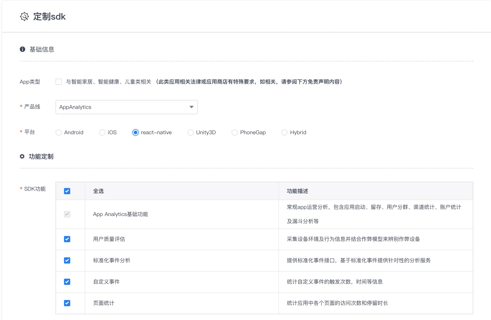
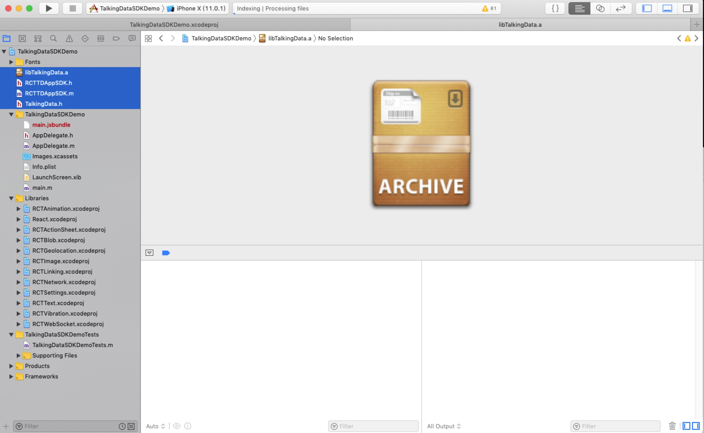
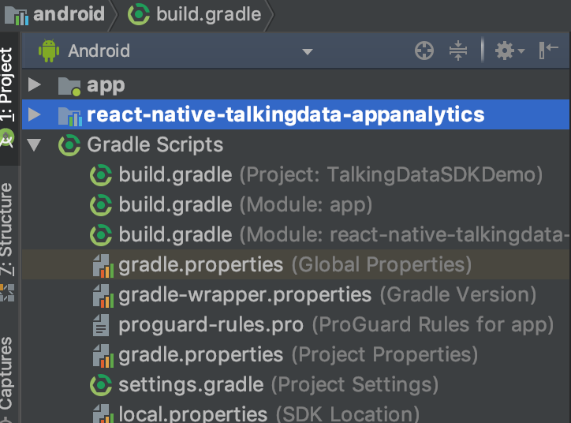
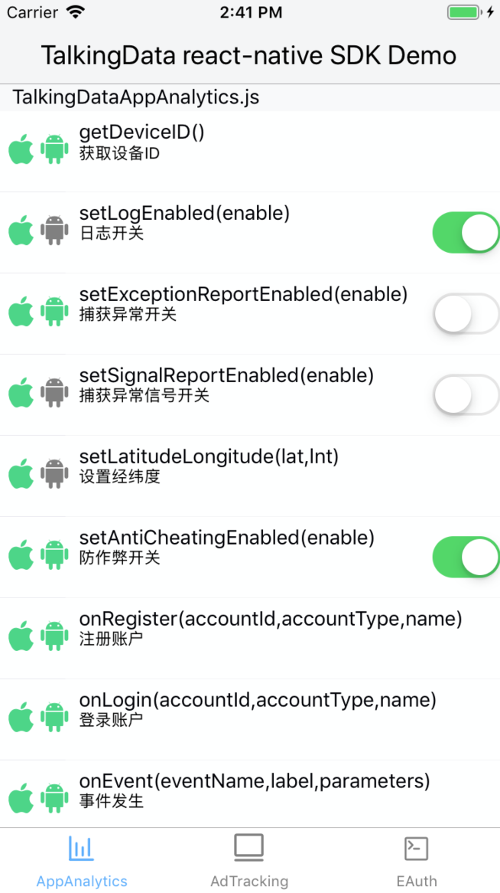

# react-native-talkingdata-appanalytics


App Analytics react-native 平台 SDK 由`封装层`和`Native SDK`两部分构成，目前[GitHub](https://github.com/TalkingData/AppAnalytics_SDK_ReactNative)上提供了封装层代码，需要从 [TalkingData官网](https://www.talkingdata.com/spa/sdk/#/config) 下载最新版的 Android 和 iOS 平台 Native SDK，组合使用。

## 目录

* [集成说明](#integration)
* [INSTALL & 安装](#install)
* [IMPORT &  引用](#usage)
* [API & 示例](#api)
* [Run Demo & 运行Demo](#rundemo)
* [LICENSE & 许可](#license)

## 版本支持

⚠️ 支持 React Native **0.47+**


---

<span id="integration"></span>
### 集成说明
1. 下载本项目（封装层）到本地；  
2. 访问 [TalkingData官网](https://www.talkingdata.com/spa/sdk/#/config?productLine=AppAnalytics&sdkPlatform=react-native) 下载最新版的 Android 和 iOS 平台 App Analytics SDK（ Native SDK）
选择 react-native 平台进行功能定制；
 
	
3. 将下载的最新版 `Native SDK` 复制到`封装层`中，构成完整的 react-native SDK。  
	- Android 平台  
		* 将最新的 .jar 文件复制到 `lib/AppAnalytics/android/src/main/libs/` 目录下
		* 修改lib/AppAnalytics/android/build.gradle中jar包的名称为新jar包的名称

			</img>
	- iOS 平台  
		* 将最新的 .a 文件复制到 `lib/AppAnalytics/ios` 目录下
4. 按 `Native SDK` 功能选项对`封装层`代码进行必要的删减，详见“注意事项”第2条；
5. 将 react-native SDK 集成您需要统计的工程中，并按 [集成文档](http://doc.talkingdata.com/posts/35) 进行必要配置和功能调用。

### 注意事项
1. 分别选择 Android 和 iOS 平台进行功能定制时，请确保两个平台功能项一致。
2. 如果申请 Native SDK 时只选择了部分功能，则需要在本项目中删除未选择功能对应的封装层代码。  
	a) 未选择`自定义事件`功能则删除以下4部分  
	删除 `lib/AppAnalytics/TalkingDataAppAnalytics.js` 文件中如下代码：

	```
	...
	
	static onEvent(eventName,label,parameters){
		...
	}

	static setGlobalKV(k,v){
		...
	}

	static removeGlobalKV(k){
		...
	}
	
	...
	```
	删除 `lib/AppAnalytics/android/src/main/java/com/talkingdata/appanalytics/TalkingData.java` 文件中如下代码：

	```
	...

    @ReactMethod
    public void setGlobalKVMap(String key, ReadableMap value) {
        ...
    }
  
    @ReactMethod
    public void setGlobalKVArray(String key, ReadableArray value) {
        ...
    }

    @ReactMethod
    public void setGlobalKVDouble(String key, double value) {
        ...
    }

    @ReactMethod
    public void setGlobalKVString(String key, String value) {
        ...
    }

    @ReactMethod
    public void setGlobalKVBoolean(String key, boolean value) {
        ...
    }

    @ReactMethod
    public void removeGlobalKV(String key) {
        ...
    }
    
    @ReactMethod
    public void onEvent(String eventId, String eventLabel, ReadableMap map) {
        ...
    }
    
    ...
	```
	删除 `lib/AppAnalytics/ios/RCTTDAppSDK.m` 文件中如下代码：

	```
	...
	
	RCT_EXPORT_METHOD(onEvent:(NSString *)eventName
	                  label:(NSString*)label
	                  parameters:(NSDictionary*)parameters)
	{
	  ...
	}

	RCT_EXPORT_METHOD(setGlobalKV:(NSString *)key value:(id)value)
	{
	  ...
	}
	
	RCT_EXPORT_METHOD(removeGlobalKV:(NSString *)key)
	{
	  ...
	}
	
	...
	```

	删除 `src/AppAnalytics/ios/TalkingData.h` 文件中如下代码：

	```
	...
	
	+ (void)trackEvent:(NSString *)eventId;
	+ (void)trackEvent:(NSString *)eventId label:(NSString *)eventLabel;
	+ (void)trackEvent:(NSString *)eventId
	             label:(NSString *)eventLabel
	        parameters:(NSDictionary *)parameters;
	+ (void)setGlobalKV:(NSString *)key value:(id)value;
	+ (void)removeGlobalKV:(NSString *)key;

	...
	```
	b) 未选择`标准化事件分析`功能则删除以下4部分  
	删除 `lib/AppAnalytics/TalkingDataAppAnalytics.js` 文件中如下代码：

	```
	...
	
	class TalkingDataOrder {

		constructor(orderId,total,currencyType) {
			...
	  	}
	
	  	addItem(itemId,category,name,unitPrice,amount){
		  	...	  	
		}
	
	  	get orderString(){
	  		...
	  	}
	}
	
	class TalkingDataShoppingCart {
		
		constructor(){
			...
		}
	
	  	addItem(itemId,category,name,unitPrice,amount){
	  		...
	  	}
	
	  	get shoppingCartString(){
	  		...
	  	}
	}
	
	...
	
	static onPlaceOrder(accountId,order){
		...
	}

	static onOrderPaySucc(accountId,payType,order){
		...
	}

	static onViewItem(itemId,category,name,unitPrice){
		...
	}

	static onAddItemToShoppingCart(itemId,category,name,unitPrice,amount){
		...
	}

	static onViewShoppingCart(shoppingCart){
		...
	}
	
	...
	```
	
	删除 `lib/AppAnalytics/android/src/main/java/com/talkingdata/appanalytics/TalkingData.java` 文件中如下代码：

	```
	...
	
	import com.tendcloud.tenddata.Order;
	import com.tendcloud.tenddata.ShoppingCart;
	
	...
	
    @ReactMethod
    public void onPlaceOrder(String accountID, String order) {
        ...
    }

    @ReactMethod
    public void onOrderPaySucc(String accountID, String payType, String order) {
        ...
    }

    @ReactMethod
    public void onAddItemToShoppingCart(String itemId, String category, String name, int unitPrice, int count) {
        ...
    }

    @ReactMethod
    public void onViewItem(String itemId, String category, String name, int unitPrice) {
        ...
    }

    @ReactMethod
    public void onViewShoppingCart(String shoppingCart) {
        ...
    }	
    
    ...
    
    private Order getOrder(String json){
        ...
    }

    private ShoppingCart getShoppingCart(String json){
        ...
    }
	
	...
	```

	删除 `src/AppAnalytics/ios/RCTTDAppSDK.m` 文件中如下代码：

	```
	...
	
	RCT_EXPORT_METHOD(onPlaceOrder:(NSString *)accountId order:(NSString *)orderString)
	{
		...
	}
	
	RCT_EXPORT_METHOD(onOrderPaySucc:(NSString *)accountId payType:(NSString *)payType order:(NSString *)orderString)
	{
	  	...
	}
	
	RCT_EXPORT_METHOD(onViewItem:(NSString *)itemId category:(NSString *)category name:(NSString *)name unitPrice:(int)unitPrice)
	{
		...
	}
	RCT_EXPORT_METHOD(onAddItemToShoppingCart:(NSString *)itemId category:(NSString *)category name:(NSString *)name unitPrice:(int)unitPrice amount:(int)amount)
	{
		...
	}
	RCT_EXPORT_METHOD(onViewShoppingCart:(NSString *)shoppingCartString)
	{
		...
	}
	
	...
	
	- (TalkingDataOrder *)stringToOrder:(NSString *)orderStr {
		...
	}

	- (TalkingDataShoppingCart *)stringToShoppingCart:(NSString *)shoppingCartStr {
		...
	}
	
	...
	```
	删除 `src/AppAnalytics/ios/TalkingData.h` 文件中如下代码：

	```
	...
	
	@interface TalkingDataOrder : NSObject
	+ (TalkingDataOrder *)createOrder:(NSString *)orderId total:(int)total currencyType:(NSString *)currencyType;
	- (TalkingDataOrder *)addItem:(NSString *)itemId category:(NSString *)category name:(NSString *)name unitPrice:(int)unitPrice amount:(int)amount;
	@end

	@interface TalkingDataShoppingCart : NSObject
	+ (TalkingDataShoppingCart *)createShoppingCart;
	- (TalkingDataShoppingCart *)addItem:(NSString *)itemId category:(NSString *)category name:(NSString *)name unitPrice:(int)unitPrice amount:(int)amount;
	@end
	
	...
	
	+ (void)onPlaceOrder:(NSString *)account order:(TalkingDataOrder *)order;
	+ (void)onOrderPaySucc:(NSString *)account payType:(NSString *)payType order:(TalkingDataOrder *)order;
	+ (void)onViewItem:(NSString *)itemId category:(NSString *)category name:(NSString *)name unitPrice:(int)unitPrice;
	+ (void)onAddItemToShoppingCart:(NSString *)itemId category:(NSString *)category name:(NSString *)name unitPrice:(int)unitPrice amount:(int)amount;
	+ (void)onViewShoppingCart:(TalkingDataShoppingCart *)shoppingCart;
	
	...
	```
	c) 未选择`页面统计`功能则删除以下4部分  
	删除 `lib/AppAnalytics/TalkingDataAppAnalytics.js` 文件中如下代码：

	```
	...
	
	static onPageStart(pageName) {
		...
	}

	static onPageEnd(pageName){
		...
	}
	
	...
	```
	删除 `lib/AppAnalytics/android/src/main/java/com/talkingdata/appanalytics/TalkingData.java` 文件中如下代码：

	```
	...
	
    @ReactMethod
    public void onPageStart(String pageName) {
        ...
    }

    @ReactMethod
    public void onPageEnd(String pageName) {
        ...
    }
    
    ...
	```

	删除 `src/AppAnalytics/ios/RCTTDAppSDK.m` 文件中如下代码：

	```
	...
	
	RCT_EXPORT_METHOD(onPageStart:(NSString *)pageName)
	{
	  ...
	}
	RCT_EXPORT_METHOD(onPageEnd:(NSString *)pageName)
	{
	  ...
	}
	
	...
	```

	删除 `src/AppAnalytics/ios/TalkingData.h` 文件中如下代码：

	```
	...
	
	+ (void)trackPageBegin:(NSString *)pageName;
	+ (void)trackPageEnd:(NSString *)pageName;

	...
	```
	d) 未选择`用户质量评估`功能则删除以下4部分  
	删除 `lib/AppAnalytics/TalkingDataAppAnalytics.js` 文件中如下代码：

	```
	...
	
	static setAntiCheatingEnabled(enable){
		...
	}
	
	...
	```
	删除 `lib/AppAnalytics/android/src/main/java/com/talkingdata/appanalytics/TalkingData.java` 文件中如下代码：

	```
	...
	
    @ReactMethod
    public void setAntiCheatingEnabled(boolean enabled){
        ...
    }
    
   ...
	```

	删除 `lib/AppAnalytics/ios/RCTTDAppSDK.m` 文件中如下代码：

	```
	...
	
	RCT_EXPORT_METHOD(setAntiCheatingEnabled:(BOOL)enabled)
	{
	  ...
	}
	
	...
	```
	删除 `src/AppAnalytics/ios/TalkingData.h` 文件中如下代码：

	```
	...
	
	+ (void)setAntiCheatingEnabled:(BOOL)enabled;

	...
	```


---


<span id="install"></span>

## INSTALL & 安装


#### iOS


将`lib/AppAnalytics/ios`目录下`libTalkingData.a`,`TalkingData.h`,`RCTTDAppSDK.h`,`RCTTDAppSDK.m`拖入到工程目录

</img>


#### Android


* 将`lib/AppAnalytics/android`以Module方式引入项目中：

</img>


* 在 `MainApplication.java` 中添加:
  
```diff
+ import com.talkingdata.appanalytics.TalkingDataPackage;

  public class MainApplication extends Application implements ReactApplication {
    //......

    @Override
    protected List<ReactPackage> getPackages() {
      return Arrays.<ReactPackage>asList(
+         new TalkingDataPackage(),
          new MainReactPackage()
      );
    }
    
    ......
  }
```


---

<span id="usage"></span>
## IMPORT &  引用

JS层引用头文件

```js
import {TalkingDataAppAnalytics,TDACCOUNT,TalkingDataOrder,TalkingDataShoppingCart} from 'react-native-talkingdata-appanalytics'
```

#### iOS
添加初始化代码

```diff
+ #import "TalkingData.h"

  -(BOOL)application:(UIApplication *)application didFinishLaunchingWithOptions:(NSDictionary *)launchOptions
{
  
+  [TalkingData sessionStarted:@"你的appid" withChannelId:@"appstore"];

  NSURL *jsCodeLocation;

  jsCodeLocation = [[RCTBundleURLProvider sharedSettings] jsBundleURLForBundleRoot:@"index.ios" fallbackResource:nil];

  RCTRootView *rootView = [[RCTRootView alloc] initWithBundleURL:jsCodeLocation
                                                      moduleName:@"rnDemo"
                                               initialProperties:nil
                                                   launchOptions:launchOptions];
  rootView.backgroundColor = [[UIColor alloc] initWithRed:1.0f green:1.0f blue:1.0f alpha:1];

  self.window = [[UIWindow alloc] initWithFrame:[UIScreen mainScreen].bounds];
  UIViewController *rootViewController = [UIViewController new];
  rootViewController.view = rootView;
  self.window.rootViewController = rootViewController;
  [self.window makeKeyAndVisible];
  return YES;
}

```

#### Android

添加初始化代码

* 在 `MainApplication.java` 中添加:
  
```diff
+ import com.tendcloud.tenddata.TCAgent;

  public class MainApplication extends Application implements ReactApplication {
    //......

    @Override
    public void onCreate() {
       super.onCreate();
+      TCAgent.init(this, "您的 App ID", "渠道 ID");
+      // 如果已经在AndroidManifest.xml配置了App ID和渠道 ID，调用TCAgent.init(this)即可；或与AndroidManifest.xml中的对应参数保持一致。
       SoLoader.init(this, /* native exopackage */ false);
    }
    ......
  }
```

* 在 `AndroidManifest.xml` 中添加：

```diff
<!--?xml version="1.0" encoding="utf-8"?-->
<manifest ......>
+  <uses-permission android:name="android.permission.INTERNET" /><!-- 允许程序联网和发送统计数据的权限。-->
+  <uses-permission android:name="android.permission.ACCESS_NETWORK_STATE" /><!-- 允许应用检测网络连接状态，在网络异常状态下避免数据发送，节省流量和电量。-->
+  <uses-permission android:name="android.permission.READ_PHONE_STATE"  /><!-- 允许应用以只读的方式访问手机设备的信息，通过获取的信息来唯一标识用户。-->
+  <uses-permission android:name="android.permission.ACCESS_WIFI_STATE"  /><!-- 获取设备的MAC地址，同样用来标识唯一用户。-->
+  <uses-permission android:name="android.permission.WRITE_EXTERNAL_STORAGE"  /><!-- 用于保存设备信息，以及记录日志。-->
+  <uses-permission android:name="android.permission.GET_TASKS"  /><!-- (建议配置) 获取当前应用是否在显示应用，可以更精准的统计用户活跃-->
+  <uses-permission android:name="android.permission.ACCESS_FINE_LOCATION"  /><!-- (可选权限) 可通过GPS获取设备的位置信息，用来修正用户的地域分布数据，使报表数据更准确。-->
+  <uses-permission android:name="android.permission.ACCESS_COARSE_LOCATION"  /><!-- (可选权限) 用来获取该应用被使用的粗略位置信息。-->

  <application ......>
  <activity ......>
  ......
  </activity>
  ......
+  <service android:name="com.talkingdata.sdk.TDAntiCheatingService"
+            android:process="com.talkingdata.sdk.TDAntiCheatingService">  <!--用户质量评估Service可以配置在主进程或者单独进程-->
+            <intent-filter>
+                <action android:name="com.talkingdata.sdk.TDAntiCheatingService" />
+            </intent-filter>
+  </service>
+  <meta-data android:name="TD_APP_ID" android:value="Your_app_id" />
+  <meta-data android:name="TD_CHANNEL_ID" android:value="Your_channel_id" />
  </application>
</manifest>
```


<span id="api"></span>
## API & 示例

| 方法                    | 参数         |  iOS | Android |  desc     |
| :---- | :----- | :-- | :---- | :-------- |
| [getDeviceID(callback)](#getdeviceid)|    enabled bool      |  ✅  |   ✅   |  获取设备ID  |
| [setLogEnabled(enable)](#setlogenabled) |    enabled bool      |  ✅  |   ❌   |  开启/关闭日志功能  |
| [setExceptionReportEnabled(enable)](#setexceptionreportenabled)|    enabled bool      |  ✅  |   ✅   |  开启/关闭异常捕获功能(捕获原生代码异常) |
| [setSignalReportEnabled(enable)](#setsignalreportenabled))   |    enabled bool      |  ✅  |   ❌   | 开启/关闭异常信号捕获(原生异常信号) |
| [setLatitudeLongitude(lat,lnt)](#setlatitudelongitude)                 |    lat 经度，lnt纬度      |  ✅  |   ❌   |  自定义经纬度 |
| [setAntiCheatingEnabled(enable)](#setanticheatingenabled)                 |    enabled bool      |  ✅  |   ✅   |  开启/关闭用户质量评估(反作弊功能)  |
| [onRegister(accountId,accountType,name)](#onregister)                 |    accountId 账户id，accountType 账户类型，name 账户昵称     |  ✅  |   ✅  |  注册接口用于记录用户在使用应用过程中的注册行为。建议在注册成功时调用此接口。 |
| [onLogin(accountId,accountType,name)](#onlogin)                 |    accountId 账户id，accountType 账户类型，name 账户昵称      |  ✅  |   ✅   |  登录接口用于记录用户在使用应用过程中的登录行为。  |
| [onEvent(eventName,label,parameters)](#onevent)                 |    eventName 事件名称，label 事件标签(自定义),parameters 参数     |  ✅  |   ✅   |  自定义事件用于追踪任何需要了解的用户行为，如：用户点击某功能按钮、填写某个输入框、触发了某个广告等。 |
| [setGlobalKV(k,v)](#setglobalkv)                 |    k 全局key ，v 全局的value    |  ✅  |   ✅   |  移除全局的key,value。|
| [removeGlobalKV(k)](#removeglobalkv)                 |    k 需要删除的全局的key      |  ✅  |   ✅   |  删除全局数据  |
| [onPageStart(pageName)](#onpagestart)                 |   pageName 页面名称     |  ✅  |   ✅   |  触发页面事件，在页面加载完毕的时候调用，用于记录页面名称和使用时长，和 onPageEnd 配合使用  |
| [onPageEnd(pageName)](#onpageend)                 |    pageName 页面名称      |  ✅  |   ✅   |  触发页面事件，在页面加载完毕的时候调用，用于记录页面名称和使用时长，和 onPageBegin 配合使用|
| [onPlaceOrder(accountId,orderString)](#onplaceorder)                 |    accountId 账户id,orderString 订单的字符串     |  ✅  |   ✅   |  下单接口用于记录用户在使用应用过程中的成功下单的行为。 下单接口由3个子接口构成：创建订单、添加订单详情、成功下单。  |
| [onOrderPaySucc(accountId,payType,orderString)](#onOrderPaySucc(accountId,payType,orderString))                 |    accountId账户id,payType 支付类型,orderString 订单的字符串     |  ✅  |   ✅   |  成功支付订单接口用于记录用户完成订单支付的行为。 |
| [onViewItem(itemId,category,name)](#onviewitem)                 |   itemId item的id,category 类别,name item的名称    |  ✅  |   ✅   | 用于记录用户查看商品详情的行为。 |
| [onAddItemToShoppingCart(itemId,category,name,unitPrice,amount)](#onadditemtoshoppingcart)                 |    itemId item的ID,category 类别,name 名称,unitPrice 单价,amount 数量     |  ✅  |   ✅   |  用于记录用户将商品加入购物车的行为。|
| [onViewShoppingCart(shoppingCartString)](#onviewshoppingcart)                 |   shoppingCartString 购物车字符串    |  ✅  |   ✅   | 查看购物车用于记录用户浏览购物车内商品的行为。 这个接口由3个子接口构成：创建购物车、添加购物车详情、查看购物车。调用时需要按顺序完成这3个子接口的调用，否则可能会无法产生正确的查看购物车行为数据。 |

## 账户类型AccountType 枚举

| 账户类型                  | 枚举含义                  |
| ------------------------ | -------------------     |
| ANONYMOUS					 | 匿名账户	|
| REGISTERED|显性注册账户|
|  SINA_WEIBO|新浪微博|
|  QQ|QQ账户|
|  QQ_WEIBO|腾讯微博|
|  ND91|91账户|
|  WEIXIN|微信|
|  TYPE1|自定义类型1|
|  TYPE2|自定义类型2|
|  TYPE3|自定义类型3|
|  TYPE4|自定义类型4|
|  TYPE5|自定义类型5|
|  TYPE6|自定义类型6|
|  TYPE7|自定义类型7|
|  TYPE8|自定义类型8|
|  TYPE9|自定义类型9|
|  TYPE10|自定义类型10|

---


<span id="getdeviceid"></span>
### getDeviceID(callback)

获取设备ID

**Examples**

```js
import {TalkingDataAppAnalytics} from 'react-native-talkingdata-appanalytics'

TalkingDataAppAnalytics.getDeviceID((device_id)=>{
   //do something with device_id
});
```

**Notes**

> 此接口是异步接口
>
> 接口支持iOS+Android平台。

---

<span id="setlogenabled"></span>
### setLogEnabled(enable)

开启/关闭日志功能 

**Examples**

```js
import {TalkingDataAppAnalytics} from 'react-native-talkingdata-appanalytics'

logEnable = false;
TalkingDataAppAnalytics.setLogEnabled(logEnable);

```

**Notes**

> 默认是开启状态。
> 
> 接口只支持iOS平台。
> 
> 在js层调用不需要写任何区分平台的代码，接口内部已经做了调整。在Android平台不会发生任何变化和导致异常。
> 

**参数**

* **logEnable (required):** Boolean


---

<span id="setexceptionreportenabled"></span>
### setExceptionReportEnabled(enable)

开启/关闭异常捕获功能(捕获原生代码异常) 

**Examples**

```js
import {TalkingDataAppAnalytics} from 'react-native-talkingdata-appanalytics'

excpEnable = false;
TalkingDataAppAnalytics. setExceptionReportEnabled(excpEnable);

```

**Notes**

> 默认是关闭状态。
> 
> 如果需要开启异常捕捉功能，请将值设置成YES,并且在初始化之后尽早调用
>
> 接口支持iOS+Android平台。

**参数**

* **excpEnable (required):** Boolean

---

<span id="setsignalreportenabled"></span>
### setSignalReportEnabled(enable)

开启/关闭异常信号捕获(原生异常信号)

**Examples**

```js
import {TalkingDataAppAnalytics} from 'react-native-talkingdata-appanalytics'

signalEnable = false;
TalkingDataAppAnalytics. setSignalReportEnabled(signalEnable);

```

**Notes**

> 默认是关闭状态。
> 
> 如果需要开启异常信号捕捉功能，请将值设置成YES,并且在初始化之后尽早调用
> 
> 接口只支持iOS平台。
> 
> 在js层调用不需要写任何区分平台的代码，接口内部已经做了调整。在Android平台不会发生任何变化和导致异常。


**参数**

* **signalEnable (required):** Boolean


---

<span id="setlatitudelongitude"></span>
### setLatitudeLongitude(lat,lnt)

自定义经纬度

**Examples**

```js
import {TalkingDataAppAnalytics} from 'react-native-talkingdata-appanalytics'

lat = 30; //纬度
lnt = 50; //经度
TalkingDataAppAnalytics.setLatitudeLongitude(lat,lnt);

```

**Notes**

> 接口只支持iOS平台。
> 

**参数**

* **lat (required):** number 纬度
* **lnt (required):** number 经度


---

<span id="setanticheatingenabled"></span>
### setAntiCheatingEnabled(enable)

开启/关闭用户质量评估(反作弊功能)

**Examples**

```js
import {TalkingDataAppAnalytics} from 'react-native-talkingdata-appanalytics'

acEnable = false;
TalkingDataAppAnalytics. setAntiCheatingEnabled(acEnable)
```

**Notes**
> 默认是开启状态。
> 
> 接口支持iOS+Android平台。

**参数**

* **acEnable (required):** Boolean

---

<span id="onregister"></span>
### onRegister(accountId,accountType,name)

注册接口用于记录用户在使用应用过程中的注册行为。建议在注册成功时调用此接口。

**Examples**

```js
import {TalkingDataAppAnalytics,TDACCOUNT} from 'react-native-talkingdata-appanalytics'

accountId = '123'; //账户id
accountType = TDACCOUNT.ANONYMOUS; //账户类型 枚举
accountName = 'NickName'; //账户昵称
TalkingDataAppAnalytics.onRegister(accountId,accountType,accountName);
```

**Notes**

> 接口支持iOS+Android平台。
> 

**参数**

* **accountId (required):** string 账户ID
* **accountType (required):** TDACCOUNT枚举 账户类型
* **accountName (required):** string 账户昵称

---

<span id="onlogin"></span>
### onLogin(accountId,accountType,name)

登录接口用于记录用户在使用应用过程中的登录行为。

**Examples**

```js
import {TalkingDataAppAnalytics,TDACCOUNT} from 'react-native-talkingdata-appanalytics'

accountId = '123'; //账户id
accountType = TDACCOUNT.ANONYMOUS; //账户类型 枚举
accountName = 'NickName'; //账户昵称
TalkingDataAppAnalytics.onLogin(accountId,accountType,accountName);
```

**Notes**
> 接口支持iOS+Android平台。


**参数**

* **accountId (required):** string 账户ID
* **accountType (required):** TDACCOUNT枚举 账户类型
* **accountName (required):** string 账户昵称

---

<span id="onevent"></span>
### onEvent(eventName,label,parameters)

自定义事件用于追踪任何需要了解的用户行为，如：用户点击某功能按钮、填写某个输入框、触发了某个广告等。   

**Examples**

```js
import {TalkingDataAppAnalytics} from 'react-native-talkingdata-appanalytics'

eventName = 'click_btn'; //事件名称
eventLabel = 'my_custom_label'; //事件标签
parameter = {'btn_name':'xx_btn','btn_color':'xxcolor'} //事件参数
TalkingDataAppAnalytics.onEvent(eventName, eventLabel,parameter);

```

**Notes**

> 接口支持iOS+Android平台。

**参数**

* **eventName (required):** string 事件名称
* **eventLabel (required):** string 事件标签
* **parameters (required):** object 事件参数

---

<span id="setglobalkv"></span>
### setGlobalKV(k,v)

设置全局的key,value

**Examples**

```js
import {TalkingDataAppAnalytics} from 'react-native-talkingdata-appanalytics'

globalKey = 'gkey'; //全局的key
globalValue = 'gvalue'; //全局的value
TalkingDataAppAnalytics.setGlobalKV(globalKey,globalValue);

```

**Notes**
> 接口支持iOS+Android平台。

**参数**

* **globalKey (required):** string 全局的key
* **globalValue (required):** any 全局的value

--- 

<span id="removeglobalkv"></span>
### removeGlobalKV(k)

移除全局的key,value。

**Examples**

```js
import {TalkingDataAppAnalytics} from 'react-native-talkingdata-appanalytics'

globalKey = 'gkey'; //全局的key
TalkingDataAppAnalytics.removeGlobalKV(globalKey);

```

**Notes**
> 接口支持iOS+Android平台。

**参数**

* **globalKey (required):** string 全局的key


--- 

<span id="onpagestart"></span>
### onPageStart(pageName)

触发页面事件，在页面加载完毕的时候调用，用于记录页面名称和使用时长，和 `onPageEnd` 配合使用

**Examples**

```js
import {TalkingDataAppAnalytics} from 'react-native-talkingdata-appanalytics'

pageName = 'homePage'; //页面名称
TalkingDataAppAnalytics.onPageStart(pageName);

```

**Notes**
> 接口支持iOS+Android平台。

**参数**

* **pageName (required):** string 页面名称

--- 

<span id="onpageend"></span>
### onPageEnd(pageName)

触发页面事件，在页面加载完毕的时候调用，用于记录页面名称和使用时长，和 `onPageBegin` 配合使用

**Examples**

```js
import {TalkingDataAppAnalytics} from 'react-native-talkingdata-appanalytics'

pageName = 'homePage'; //页面名称
TalkingDataAppAnalytics.onPageEnd(pageName);

```

**Notes**
> 接口支持iOS+Android平台。

**参数**

* **pageName (required):** string 页面名称

--- 

<span id="onplaceorder"></span>
### onPlaceOrder(accountId,orderString)

下单接口用于记录用户在使用应用过程中的成功下单的行为。
下单接口由3个子接口构成：创建订单、添加订单详情、成功下单。

**Examples**

```js
import {TalkingDataAppAnalytics, TalkingDataOrder} from 'react-native-talkingdata-appanalytics'

accountId = 'aid_123';//账户id
orderId = 'oid_123';//订单id
total = 59900; //总钱数 单位为分
currencyType = 'CNY';//货币类型
order = new TalkingDataOrder(orderId,total,currencyType);//生成新的订单对象
order.addItem('007','家电','电视',499900,1)
TalkingDataAppAnalytics.onPlaceOrder(accountId, order.orderString);

```

**Notes**
> 接口支持iOS+Android平台。

**参数**

* **accountId (required):** string 账户id
* **orderId (required):** string 订单id
* **total (required):** string 总钱数 单位为分
* **currencyType (required):** string 货币类型


--- 

<span id="onorderpaysucc"></span>
### onOrderPaySucc(accountId,payType,orderString)

成功支付订单接口用于记录用户完成订单支付的行为。


**Examples**

```js
import {TalkingDataAppAnalytics, TalkingDataOrder} from 'react-native-talkingdata-appanalytics'

accountid = 'aid_123';//账户id

payType = '银联支付' //支付类型

orderId = 'oid_123';//订单id
total = 59900; //总钱数 单位为分
currencyType = 'CNY';//货币类型
order = new TalkingDataOrder(orderId,total,currencyType);//生成新的订单对象
order.addItem('008','家电','冰箱',399900,1)
TalkingDataAppAnalytics.onOrderPaySucc(accountid,payType,order.orderString);

```

**Notes**

> 接口支持iOS+Android平台。

**参数**

* **accountid (required):** string 账户id
* **payType (required):** string 支付方式
* **orderId (required):** string 订单id
* **total (required):** number 总钱数 单位为分
* **currencyType (required):** string 货币类型

---

<span id="onviewitem"></span>
### onViewItem(itemId,category,name,unitPrice)


用于记录用户查看商品详情的行为。

**Examples**

```js
import {TalkingDataAppAnalytics} from 'react-native-talkingdata-appanalytics'

itemId = 'item_123';//订单id
category = 'item_category'; //类别
name = 'item_name';//道具名称
unitPrice = 123

TalkingDataAppAnalytics.onViewItem(itemId,category,name,unitPrice);

```

**Notes**
> 接口支持iOS+Android平台。

**参数**

* **itemId (required):** string 道具id
* **category (required):** string 道具类别
* **name (required):** string 道具名称
* **unitPrice (required):** number 道具单价


---

<span id="onadditemtoshoppingcart"></span>
### onAddItemToShoppingCart(itemId,category,name,unitPrice,amount)

用于记录用户将商品加入购物车的行为。


**Examples**

```js
import {TalkingDataAppAnalytics} from 'react-native-talkingdata-appanalytics'

itemId = 'item_123';//订单id
category = 'item_category'; //类别
name = 'item_name';//道具名称
unitPrice = 120; //单价 单位为分
amount = 100; //数量

TalkingDataAppAnalytics.onAddItemToShoppingCart(itemId,category,name,unitPrice,amount);

```

**Notes**
> 接口支持iOS+Android平台。

**参数**

* **itemId (required):** string 道具id
* **category (required):** string 道具类别
* **name (required):** string 道具名称
* **unitPrice (required):** number 单价 单位为分
* **amount (required):** number 数量

---

<span id="onviewshoppingcart"></span>
### onViewShoppingCart(shoppingCartString)

查看购物车用于记录用户浏览购物车内商品的行为。
这个接口由3个子接口构成：创建购物车、添加购物车详情、查看购物车。调用时需要按顺序完成这3个子接口的调用，否则可能会无法产生正确的查看购物车行为数据。

**Examples**

```js
import {TalkingDataAppAnalytics, TalkingDataShoppingCart} from 'react-native-talkingdata-appanalytics'

let talkingdataShoppingCart = new TalkingDataShoppingCart();

itemId = 'item_123';//订单id
category = 'item_category'; //类别
name = 'item_name';//道具名称
unitPrice = 120; //单价 单位为分
amount = 100; //数量                                       
talkingdataShoppingCart.addItem(itemId,category,name,unitPrice,amount); //购物车添加item

TalkingDataAppAnalytics.onViewShoppingCart(talkingdataShoppingCart.shoppingCartString);//记录添加购物车

```

**Notes**
> 接口支持iOS+Android平台。

**参数**

* **itemId (required):** string 道具id
* **category (required):** string 道具类别
* **name (required):** string 道具名称
* **unitPrice (required):** number 单价 单位为分
* **amount (required):** number 数量

---

<span id="rundemo"></span>

## Run Demo & 运行Demo
下载本项目，进入到example文件夹

```
cd example
```

安装Demo的依赖

```js
npm install --save react-native@0.57.0
npm install --save react-navigation
npm install --save react-native-actionsheet
npm install --save react-native-vector-icons
npm install --save react-native-keyboard-aware-scroll-view
```

链接静态库

```
react-native link
```

运行Demo

```js
react-native run-ios
react-native run-android
```

Demo截图




---


<span id="license"></span>
## LICENSE & 许可

[MIT LICENSE](LICENSE)

