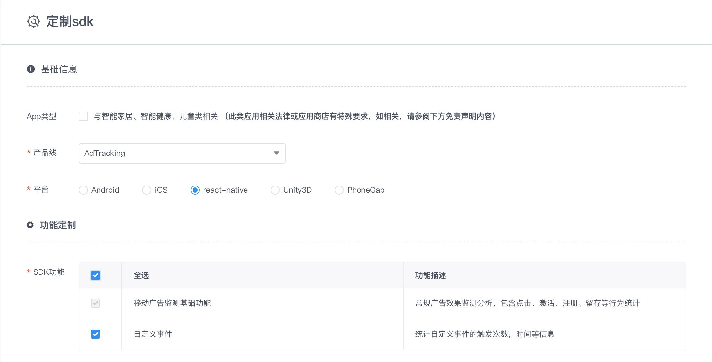
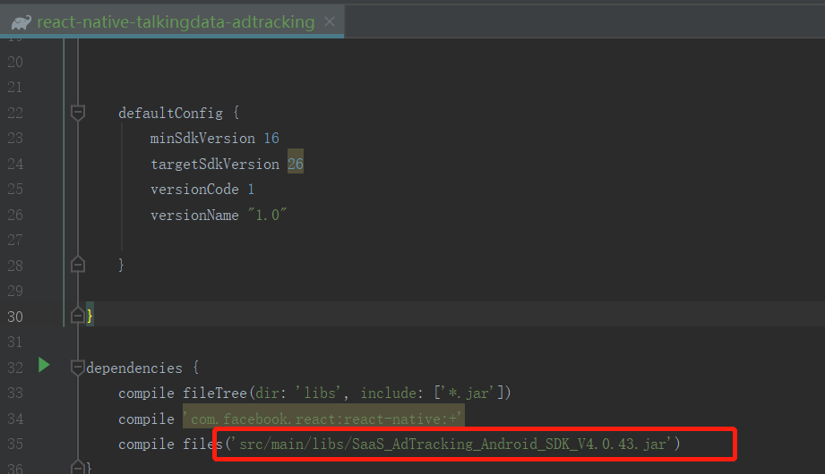
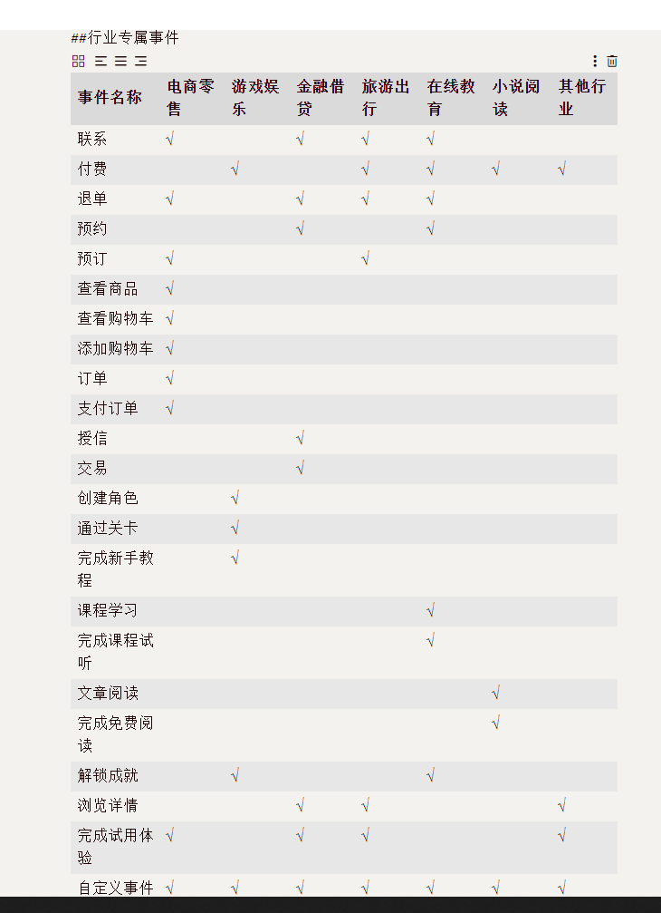
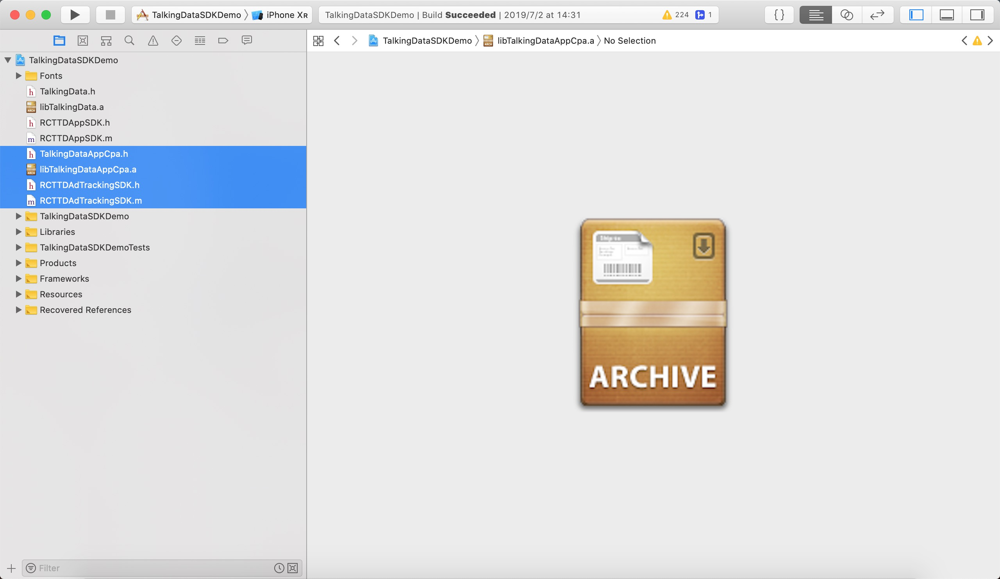

# React-native-talkingdata-adtracking

<font color=red size=5>❗️❗️❗️Warning：本仓库中的提供的静态库和jar包均为演示使用，请勿用作生产环境如果需要用于生产环境的SDK，请到[TalkingData官网](https://www.talkingdata.com/spa/sdk/#/config?productLine=AppAnalytics&sdkPlatform=Android)申请。</font>

Ad Tracking react-native 平台 SDK 由`封装层`和`Native SDK`两部分构成，目前[GitHub](https://github.com/TalkingData/AppAnalytics_SDK_ReactNative)上提供了封装层代码，需要从 [TalkingData官网](https://www.talkingdata.com/spa/sdk/#/config) 下载最新版的 Android 和 iOS 平台 Native SDK，组合使用。

## 目录

* [集成说明](#integration)
* [INSTALL & 安装](#install)
* [IMPORT &  引用](#usage)
* [Run Demo & 运行Demo](#rundemo)
* [LICENSE & 许可](#license)

## 接口文档

http://doc.talkingdata.com/posts/906

---

## 集成说明
1. 下载本项目（封装层）到本地；  

2. 访问 [TalkingData官网](https://www.talkingdata.com/spa/sdk/#/config?productLine=AppAnalytics&sdkPlatform=react-native) 下载最新版的 Android 和 iOS 平台 App Analytics SDK（ Native SDK）
  选择 react-native 平台进行功能定制；

  

3. 将下载的最新版 `Native SDK` 复制到`封装层`中，构成完整的 react-native SDK。  
  - Android 平台  
  	* 将最新的 .jar 文件复制到 `lib/AdTracking/android/src/main/libs/` 目录下
  	* 修改lib/AdTracking/android/build.gradle中jar包的名称为新jar包的名称
  	* 如果您的React Native版本较低，参考[Run Demo & 运行Demo](#rundemo)的Android部分的文件差异进行封装层的文件替换

  		</img>
  - iOS 平台  

    * 将最新的 .a 文件复制到 `lib/AdTracking/ios` 目录下

4. 按 `Native SDK` 功能选项对`封装层`代码进行必要的删减，详见“注意事项”第2条；

5. 将 react-native SDK 集成您需要统计的工程中，并按 [集成文档](http://doc.talkingdata.com/posts/35) 进行必要配置和功能调用。

#### 功能选择和代码删减

</img>

当前react-native-TD-ADTracking封装层代码包含了所有行业接口。如果在官网申请的静态库不包含上述功能和业务线，请开发者按照上图对封装层文件进行必要删减。以免对应的接口不存在对应的实现导致报错。需要删减的文件如下：

iOS:

 `RCTTDAdTrackingSDK.m`

Android

`TalkingDataAdTracking.java`

JS:

`TalkingDataAdTracking.js` 

举例：

在官网未勾选小说阅读行业。那么请对照上表，删除小说阅读行业对应的接口。这里以文章阅读接口作为举例：

删除`RCTTDAdTrackingSDK.m`的:

```
RCT_EXPORT_METHOD(onRead:(NSString *)account book:(NSString *)book begin:(int64_t)begin duration:(int)duration)
{
  [TalkingDataAppCpa onRead:account book:book begin:begin duration:duration];
}

```

删除`TalkingDataAdTracking.java`的:

```
@ReactMethod
public  void onRead(String accountId, String book, int begin, int duration) {
TalkingDataAppCpa.onRead(accountId, book, begin, duration);
}
```

删除`TalkingDataAdTracking.js` 的：

```
static onRead(account,book,begin,duration)
{
if (typeof account !== 'string') {
return;
};

if (typeof book !== 'string') {
return;
}

if (typeof begin !== 'number') {
return;
}

if (typeof duration !== 'number') {
return;
}
TDADT.onRead(account,book,begin,duration)
}

```

封装层(桥阶层)为了适配SDK，对所有接口都进行了封装。若开发者申请了不包含对应行业的包，即使不对删除，只要不发生接口调用，也不会报错，请开发者放心使用。

---

<span id="install"></span>

## INSTALL & 安装


#### iOS


将`lib/AdTracking/ios目录下`libTalkingDataAppCpa.a`,`TalkingDataAppCpa.h`,`RCTTDAdTrackingSDK.h`,`RCTTDadTrackingSDK.m`拖入到工程目录

</img>


#### Android


* 将`lib/AdTracking/android`以Module方式引入项目中：

</img>


* 在 `MainApplication.java` 中添加:
  
```diff
+ import com.talkingdata.adtracking.TalkingDataADTPackage;

  public class MainApplication extends Application implements ReactApplication {
    //......

    @Override
    protected List<ReactPackage> getPackages() {
      return Arrays.<ReactPackage>asList(
+         new TalkingDataADTPackage(),
          new MainReactPackage()
      );
    }
    
    ......
  }
```

## IMPORT &  引用

JS层引用头文件

```js
import {TalkingDataAdTracking,TalkingDataADTOrder,TalkingDataADTShoppingCart,TalkingDataAdSearch} from 'TalkingDataAdTracking'
```

#### iOS
添加初始化代码

```diff
+ #import "TalkingDataAppCpa.h"

  -(BOOL)application:(UIApplication *)application didFinishLaunchingWithOptions:(NSDictionary *)launchOptions
{
  
+  [TalkingDataAppCpa init:@"你的appid" withChannelId:@"appstore"];

  NSURL *jsCodeLocation;

  jsCodeLocation = [[RCTBundleURLProvider sharedSettings] jsBundleURLForBundleRoot:@"index.ios" fallbackResource:nil];

  RCTRootView *rootView = [[RCTRootView alloc] initWithBundleURL:jsCodeLocation
                                                      moduleName:@"rnDemo"
                                               initialProperties:nil
                                                   launchOptions:launchOptions];
  rootView.backgroundColor = [[UIColor alloc] initWithRed:1.0f green:1.0f blue:1.0f alpha:1];

  self.window = [[UIWindow alloc] initWithFrame:[UIScreen mainScreen].bounds];
  UIViewController *rootViewController = [UIViewController new];
  rootViewController.view = rootView;
  self.window.rootViewController = rootViewController;
  [self.window makeKeyAndVisible];
  return YES;
}

```

#### Android

添加初始化代码

* 在 `MainApplication.java` 中添加:
  
```diff
+ import com.tendcloud.appcpa.TalkingDataAppCpa;

  public class MainApplication extends Application implements ReactApplication {
    //......

    @Override
    public void onCreate() {
       super.onCreate();
+      TalkingDataAppCpa.init(this, "您的 App ID", "渠道 ID");
       SoLoader.init(this, /* native exopackage */ false);
    }
    ......
  }
```

* 在 `AndroidManifest.xml` 中添加：

```diff
<!--?xml version="1.0" encoding="utf-8"?-->
<manifest ......>
+  <uses-permission android:name="android.permission.INTERNET" /><!-- 允许程序联网和发送统计数据的权限。-->
+  <uses-permission android:name="android.permission.ACCESS_NETWORK_STATE" /><!-- 允许应用检测网络连接状态，在网络异常状态下避免数据发送，节省流量和电量。-->
+  <uses-permission android:name="android.permission.READ_PHONE_STATE"  /><!-- 允许应用以只读的方式访问手机设备的信息，通过获取的信息来唯一标识用户。-->
+  <uses-permission android:name="android.permission.ACCESS_WIFI_STATE"  /><!-- 获取设备的MAC地址，同样用来标识唯一用户。-->
+  <uses-permission android:name="android.permission.WRITE_EXTERNAL_STORAGE"  /><!-- 用于保存设备信息，以及记录日志。-->
+  <uses-permission android:name="android.permission.GET_TASKS"  /><!-- (建议配置) 获取当前应用是否在显示应用，可以更精准的统计用户活跃-->
+  <uses-permission android:name="android.permission.ACCESS_FINE_LOCATION"  /><!-- (可选权限) 可通过GPS获取设备的位置信息，用来修正用户的地域分布数据，使报表数据更准确。-->
+  <uses-permission android:name="android.permission.ACCESS_COARSE_LOCATION"  /><!-- (可选权限) 用来获取该应用被使用的粗略位置信息。-->

  <application ......>
  <activity ......>
  ......
  </activity>
  ......
  </application>
</manifest>
```

---

## Run Demo & 运行Demo
下载本项目，进入到example文件夹并安装依赖

```
cd example/demo_adt
npm install
```

#### iOS

双击`demo_adt.xcodeproj`

##### Xcode11适配

此部分代码作为RN库代码的一部分，并未随着仓库提交，每次新clone项目，需要手动适配。

搜索RCTModuleMethod.m 将 `static BOOL RCTParseUnused(const char** input)`修改为

```
static BOOL RCTParseUnused(const char **input)
{
  return RCTReadString(input, "__unused") ||
         RCTReadString(input, "__attribute__((__unused__))") ||
         RCTReadString(input, "__attribute__((unused))");
}

```


#### ANDROID

在`example/demo_adt`路径下执行`react-native run-android`命令运行程序

可能会遇到的问题：

* 1.java.lang.RuntimeException: SDK location not found. Define location with sdk.dir in the local.properties file or with an ANDROID_HOME environment variable.

  原因：找不到SDK

  解决方法：在Demo的android目录下新建一个local.properties的文件，然后在文件中写入

  > sdk.dir = XXX

  XXX是你的Android SDK对应的路径

* 2.Demo启动成功，但是应用界面是红色的，JS Server没有启动。可以使用命令`react-native start`启动JS Server。

  如果提示

  ```
  Invalid regular expression: /(node_modules[]react[]dist[].*|website\node_modules\.*|heapCapture\bundle.js)$/: Unterminated character class
  ```

  那么请按照以下方式解决

  原因：Node的版本较高的原因导致文件内的正则表达式无效

  解决方法：进入node_nodules搜索blacklist，如果搜索不到文件，进入路径`node_modules\react-native\packager`可找到该文件，修改

  ```
  var sharedBlacklist = [
    /node_modules[/\\]react[/\\]dist[/\\].*/,
  
    /website\/node_modules\/.*/,
  
    /heapCapture\/bundle\.js/,
  ];
  ```

  更新为

  ```
  var sharedBlacklist = [
    /node_modules[/\\]react[\/\\]dist[\/\\].*/,
  
    /website\/node_modules\/.*/,
  
    /heapCapture\/bundle\.js/,
  ];
  ```

* 3.如果执行完问题2的解决方法，启动了JS Server，并且点击RELOAD重新加载后仍然为红色，内容是:

  ```
  could not connect to development server
  ```

  那么可以执行以下两个方法进行解决：

  * 1.终端运行adb reverse tcp:8081 tcp:8081，然后在对应目录执行react-native start启动JS Server并且点击RELOAD重新加载

  * 2.尝试打开：

    ```
    http://localhost:8081/index.android.bundle?platform=android
    ```


    如果无法加载，那么执行以下步骤：
    
    ```
    1.报错页面晃动手机，显示菜单
    2.点击Dev Settings
    3.点击Debug server host & port for device
    4.设置IP和端口（ex:192.168.0.20:8081）,ip在终端执行ipconfig，使用其中的IPv4地址即可
    5.点击返回
    6.页面是空白，再次点击摇一摇，选择Reload JS程序就显示出来了
    ```


##### 赋予权限

运行成功Android项目后，会弹出设置界面，赋予悬浮窗权限即可

##### 文件差异

此版本的Demo是基于React Native v0.44.3建立的项目。Demo中对应的Module中的封装层代码因为React Native接口和类方法的变动而有所差异。

如果您的React Native项目版本是在v0.47.0-rc.0以下（不包括v0.47.0-rc.0），那么请您使用Demo中的`android\react-native-talkingdata-adtracking\src\main\java\com\talkingdata\adtracking`下的`TalkingDataADTPackage.java`文件替换封装层对应的文件

如果您的React Native项目版本是在v0.47.0-rc.0以及v0.47.0-rc.0以上的话，请直接接入封装层的代码即可

## LICENSE & 许可

[MIT LICENSE](LICENSE)

