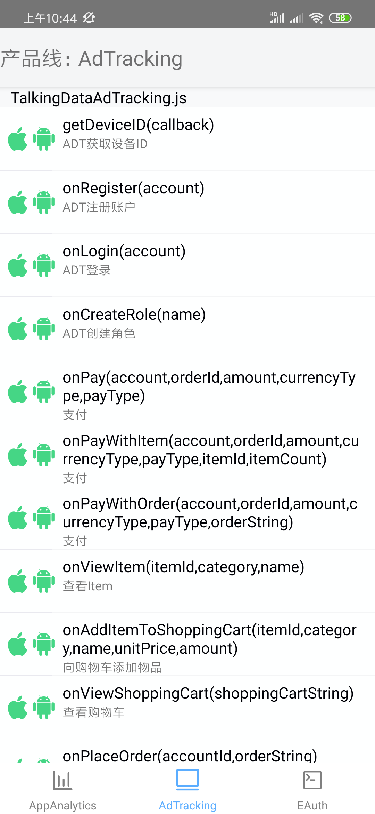

# React-native-talkingdata-adtracking


Ad Tracking react-native 平台 SDK 由`封装层`和`Native SDK`两部分构成，目前[GitHub](https://github.com/TalkingData/AppAnalytics_SDK_ReactNative)上提供了封装层代码，需要从 [TalkingData官网](https://www.talkingdata.com/spa/sdk/#/config) 下载最新版的 Android 和 iOS 平台 Native SDK，组合使用。

## 目录

* [集成说明](#integration)
* [INSTALL & 安装](#install)
* [IMPORT &  引用](#usage)
* [Run Demo & 运行Demo](#rundemo)
* [LICENSE & 许可](#license)

## 版本支持

⚠️ 支持 React Native **0.47+**

## 接口文档

http://doc.talkingdata.com/posts/906

---

## 集成说明
1. 下载本项目（封装层）到本地；  
2. 访问 [TalkingData官网](https://www.talkingdata.com/spa/sdk/#/config?productLine=AppAnalytics&sdkPlatform=react-native) 下载最新版的 Android 和 iOS 平台 App Analytics SDK（ Native SDK）
选择 react-native 平台进行功能定制；

	
3. 将下载的最新版 `Native SDK` 复制到`封装层`中，构成完整的 react-native SDK。  
  - Android 平台  
  	* 将最新的 .jar 文件复制到 `lib/AdTracking/android/src/main/libs/` 目录下
  	* 修改lib/AdTracking/android/build.gradle中jar包的名称为新jar包的名称

  		</img>
  - iOS 平台  

    * 将最新的 .a 文件复制到 `lib/AdTracking/ios` 目录下
4. 按 `Native SDK` 功能选项对`封装层`代码进行必要的删减，详见“注意事项”第2条；
5. 将 react-native SDK 集成您需要统计的工程中，并按 [集成文档](http://doc.talkingdata.com/posts/35) 进行必要配置和功能调用。

<span id="install"></span>

## INSTALL & 安装


#### iOS


将`lib/AdTracking/ios目录下`libTalkingDataAppCpa.a`,`TalkingDataAppCpa.h`,`RCTTDAdTrackingSDK.h`,`RCTTDadTrackingSDK.m`拖入到工程目录

</img>


#### Android


* 将`lib/AdTracking/android`以Module方式引入项目中：

</img>


* 在 `MainApplication.java` 中添加:
  
```diff
+ import com.talkingdata.adtracking.TalkingDataADTPackage;

  public class MainApplication extends Application implements ReactApplication {
    //......

    @Override
    protected List<ReactPackage> getPackages() {
      return Arrays.<ReactPackage>asList(
+         new TalkingDataADTPackage(),
          new MainReactPackage()
      );
    }
    
    ......
  }
```

## IMPORT &  引用

JS层引用头文件

```js
import {TalkingDataAdTracking,TalkingDataADTOrder,TalkingDataADTShoppingCart,TalkingDataAdSearch} from 'TalkingDataAdTracking'
```

#### iOS
添加初始化代码

```diff
+ #import "TalkingDataAppCpa.h"

  -(BOOL)application:(UIApplication *)application didFinishLaunchingWithOptions:(NSDictionary *)launchOptions
{
  
+  [TalkingDataAppCpa init:@"你的appid" withChannelId:@"appstore"];

  NSURL *jsCodeLocation;

  jsCodeLocation = [[RCTBundleURLProvider sharedSettings] jsBundleURLForBundleRoot:@"index.ios" fallbackResource:nil];

  RCTRootView *rootView = [[RCTRootView alloc] initWithBundleURL:jsCodeLocation
                                                      moduleName:@"rnDemo"
                                               initialProperties:nil
                                                   launchOptions:launchOptions];
  rootView.backgroundColor = [[UIColor alloc] initWithRed:1.0f green:1.0f blue:1.0f alpha:1];

  self.window = [[UIWindow alloc] initWithFrame:[UIScreen mainScreen].bounds];
  UIViewController *rootViewController = [UIViewController new];
  rootViewController.view = rootView;
  self.window.rootViewController = rootViewController;
  [self.window makeKeyAndVisible];
  return YES;
}

```

#### Android

添加初始化代码

* 在 `MainApplication.java` 中添加:
  
```diff
+ import com.tendcloud.appcpa.TalkingDataAppCpa;

  public class MainApplication extends Application implements ReactApplication {
    //......

    @Override
    public void onCreate() {
       super.onCreate();
+      TalkingDataAppCpa.init(this, "您的 App ID", "渠道 ID");
       SoLoader.init(this, /* native exopackage */ false);
    }
    ......
  }
```

* 在 `AndroidManifest.xml` 中添加：

```diff
<!--?xml version="1.0" encoding="utf-8"?-->
<manifest ......>
+  <uses-permission android:name="android.permission.INTERNET" /><!-- 允许程序联网和发送统计数据的权限。-->
+  <uses-permission android:name="android.permission.ACCESS_NETWORK_STATE" /><!-- 允许应用检测网络连接状态，在网络异常状态下避免数据发送，节省流量和电量。-->
+  <uses-permission android:name="android.permission.READ_PHONE_STATE"  /><!-- 允许应用以只读的方式访问手机设备的信息，通过获取的信息来唯一标识用户。-->
+  <uses-permission android:name="android.permission.ACCESS_WIFI_STATE"  /><!-- 获取设备的MAC地址，同样用来标识唯一用户。-->
+  <uses-permission android:name="android.permission.WRITE_EXTERNAL_STORAGE"  /><!-- 用于保存设备信息，以及记录日志。-->
+  <uses-permission android:name="android.permission.GET_TASKS"  /><!-- (建议配置) 获取当前应用是否在显示应用，可以更精准的统计用户活跃-->
+  <uses-permission android:name="android.permission.ACCESS_FINE_LOCATION"  /><!-- (可选权限) 可通过GPS获取设备的位置信息，用来修正用户的地域分布数据，使报表数据更准确。-->
+  <uses-permission android:name="android.permission.ACCESS_COARSE_LOCATION"  /><!-- (可选权限) 用来获取该应用被使用的粗略位置信息。-->

  <application ......>
  <activity ......>
  ......
  </activity>
  ......
  </application>
</manifest>
```

---

## Run Demo & 运行Demo
下载本项目，进入到example文件夹

```
cd example
```

安装Demo的依赖

```js
npm install --save react-native@0.57.0
npm install --save react-navigation
npm install --save react-native-actionsheet
npm install --save react-native-vector-icons
npm install --save react-native-keyboard-aware-scroll-view
```

适配Xcode10

```
cd node_modules/react-native/scripts 
./ios-install-third-party.sh 
cp -rf third-party ./../third-party
cd ../../../
cd node_modules/react-native/third-party/glog-0.3.5/ && ../../scripts/ios-configure-glog.sh
cd ../../../../

⚠️如果因为nullable等关键字报错，在rn模板里点fix即可。
```


链接静态库

```
react-native link
```

运行Demo

```js
~~react-native run-ios~~
iOS请直接双击打开TalkingDataSDKDemo.xcodeproj在xcode中运行
react-native run-android
```

Demo截图




## LICENSE & 许可

[MIT LICENSE](LICENSE)

